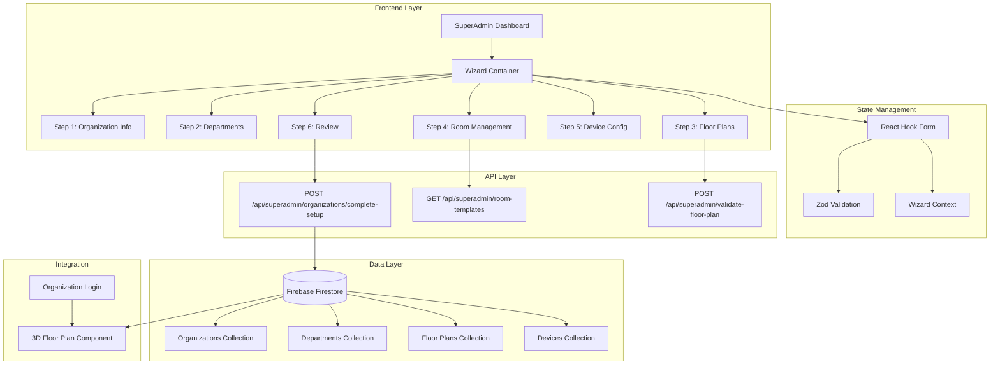
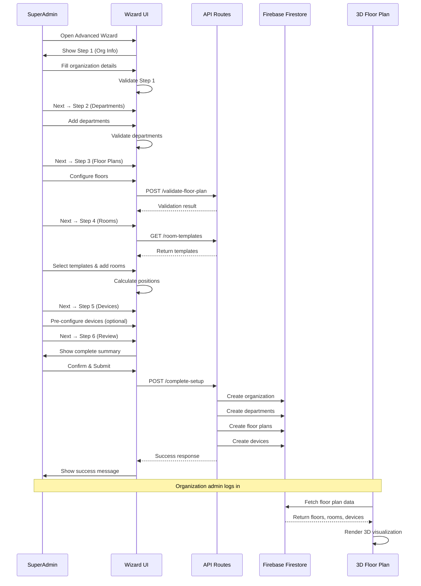

# Design Document: Advanced Organization Creation Wizard

## Overview

The Advanced Organization Creation Wizard is a comprehensive multi-step interface that enables SuperAdmins to create fully-configured organizations with departments, floor plans, rooms, and devices in a single workflow. The wizard collects structured data that automatically renders in the existing 3D Floor Plan visualization component when organization admins log in. This design focuses on progressive disclosure, real-time validation, and seamless integration with the existing Blackshield-X IoT Security Platform infrastructure.

## Architecture

The wizard follows a client-server architecture with React-based frontend components communicating with Next.js API routes that persist data to Firebase Firestore. The architecture ensures data consistency, validation at multiple layers, and seamless integration with the existing 3D visualization system.



## Main Workflow Sequence



## Components and Interfaces

### Component 1: WizardContainer

**Purpose**: Orchestrates the multi-step wizard flow, manages global state, and handles navigation between steps.

**Interface**:
```typescript
interface WizardContainerProps {
  onComplete: (organizationId: string) => void;
  onCancel: () => void;
}

interface WizardState {
  currentStep: number;
  completedSteps: Set<number>;
  organizationData: OrganizationFormData;
  departmentsData: DepartmentFormData[];
  floorsData: FloorFormData[];
  devicesData: DeviceFormData[];
  validationErrors: Record<string, string[]>;
}
```

**Responsibilities**:
- Manage wizard step progression (1-6)
- Maintain form state across all steps
- Handle auto-save functionality
- Coordinate validation across steps
- Submit complete data to API
- Display progress indicator

### Component 2: OrganizationInfoStep (Step 1)

**Purpose**: Collect basic organization information and contact details.

**Interface**:
```typescript
interface OrganizationInfoStepProps {
  data: OrganizationFormData;
  onChange: (data: OrganizationFormData) => void;
  onNext: () => void;
  errors: Record<string, string>;
}

interface OrganizationFormData {
  name: string;
  email: string;
  password: string;
  plan: 'basic' | 'pro' | 'enterprise';
  maxDevices: number;
  contactPerson: string;
  phoneNumber: string;
  address: string;
  city: string;
  state: string;
  zipCode: string;
  country: string;
}
```

**Responsibilities**:
- Render form fields for organization details
- Real-time validation (email format, password strength, unique name)
- Plan selection with device limit auto-population
- Contact information collection

### Component 3: DepartmentManagementStep (Step 2)

**Purpose**: Create and manage department structure within the organization.

**Interface**:
```typescript
interface DepartmentManagementStepProps {
  data: DepartmentFormData[];
  organizationMaxDevices: number;
  onChange: (data: DepartmentFormData[]) => void;
  onNext: () => void;
  onBack: () => void;
  errors: Record<string, string[]>;
}

interface DepartmentFormData {
  id: string;
  name: string;
  description: string;
  headOfDepartment: string;
  email: string;
  phoneNumber: string;
  budget: number;
  maxDevices: number;
}
```

**Responsibilities**:
- Add/remove/edit departments
- Validate total device allocation doesn't exceed organization limit
- Ensure unique department names
- Display department summary cards
- Bulk import from CSV (optional)

### Component 4: FloorPlanBuilderStep (Step 3)

**Purpose**: Configure floor structure and basic floor properties.

**Interface**:
```typescript
interface FloorPlanBuilderStepProps {
  data: FloorFormData[];
  onChange: (data: FloorFormData[]) => void;
  onNext: () => void;
  onBack: () => void;
  errors: Record<string, string[]>;
}

interface FloorFormData {
  id: string;
  floorNumber: number;
  floorName: string;
  totalArea: number;
  description: string;
  rooms: RoomFormData[];
}
```

**Responsibilities**:
- Add/remove/reorder floors
- Set floor properties (name, area, description)
- Validate floor numbering (sequential, unique)
- Display floor summary
- Duplicate floor feature

### Component 5: RoomManagementStep (Step 4)

**Purpose**: Create rooms using templates or custom configuration, with visual layout preview.

**Interface**:
```typescript
interface RoomManagementStepProps {
  floorsData: FloorFormData[];
  templates: RoomTemplate[];
  onChange: (floorsData: FloorFormData[]) => void;
  onNext: () => void;
  onBack: () => void;
  errors: Record<string, string[]>;
}

interface RoomFormData {
  id: string;
  name: string;
  identifier: string;
  width: number;
  height: number;
  type: string;
  capacity: number;
  departmentId: string;
  position: { x: number; y: number; width: number; height: number };
  deviceIds: string[];
}

interface RoomTemplate {
  id: string;
  name: string;
  type: string;
  description: string;
  defaultSize: { width: number; height: number };
  suggestedCapacity: number;
  deviceRecommendations: DeviceRecommendation[];
  category: 'workspace' | 'meeting' | 'utility' | 'common' | 'technical';
}
```

**Responsibilities**:
- Display room template gallery (15+ templates)
- Quick-add rooms from templates
- Custom room creation
- Auto-calculate room positions on floor
- Visual floor layout preview
- Validate total room area doesn't exceed floor area
- Bulk room creation
- Room identifier auto-generation (R101, R102, etc.)

### Component 6: DeviceConfigurationStep (Step 5)

**Purpose**: Pre-configure devices and assign them to rooms (optional step).

**Interface**:
```typescript
interface DeviceConfigurationStepProps {
  data: DeviceFormData[];
  floorsData: FloorFormData[];
  onChange: (data: DeviceFormData[]) => void;
  onNext: () => void;
  onBack: () => void;
  onSkip: () => void;
  errors: Record<string, string[]>;
}

interface DeviceFormData {
  id: string;
  name: string;
  type: 'Camera' | 'Sensor' | 'Access Control' | 'Other';
  roomId: string;
  manufacturer: string;
  model: string;
  serialNumber: string;
  status: 'online' | 'offline';
}
```

**Responsibilities**:
- Add/remove/edit devices
- Assign devices to specific rooms
- Device type selection
- Optional manufacturer/model details
- Display device count per room
- Skip option for later configuration

### Component 7: ReviewConfirmationStep (Step 6)

**Purpose**: Display comprehensive summary of all entered data and handle final submission.

**Interface**:
```typescript
interface ReviewConfirmationStepProps {
  organizationData: OrganizationFormData;
  departmentsData: DepartmentFormData[];
  floorsData: FloorFormData[];
  devicesData: DeviceFormData[];
  onSubmit: () => Promise<void>;
  onBack: () => void;
  isSubmitting: boolean;
}

interface OrganizationSummary {
  organizationName: string;
  totalFloors: number;
  totalRooms: number;
  totalArea: number;
  totalDepartments: number;
  totalDevices: number;
  devicesByType: Record<string, number>;
  roomsByType: Record<string, number>;
}
```

**Responsibilities**:
- Display complete organization summary
- Show floor-by-floor breakdown
- Department allocation summary
- Device distribution visualization
- Edit buttons to jump back to specific steps
- Terms acceptance checkbox
- Submit button with loading state
- Error handling and display

## Data Models

### Model 1: CompleteOrganizationSetup

```typescript
interface CompleteOrganizationSetup {
  organization: {
    name: string;
    email: string;
    password: string;
    plan: 'basic' | 'pro' | 'enterprise';
    maxDevices: number;
    contactPerson: string;
    phoneNumber: string;
    address: string;
    city: string;
    state: string;
    zipCode: string;
    country: string;
  };
  
  departments: {
    name: string;
    description: string;
    headOfDepartment: string;
    email: string;
    phoneNumber: string;
    budget: number;
    maxDevices: number;
  }[];
  
  floors: {
    floorNumber: number;
    floorName: string;
    totalArea: number;
    description: string;
    rooms: {
      identifier: string;
      name: string;
      type: string;
      width: number;
      height: number;
      capacity: number;
      departmentId: string;
      position: { x: number; y: number; width: number; height: number };
    }[];
  }[];
  
  devices: {
    name: string;
    type: string;
    roomId: string;
    manufacturer: string;
    model: string;
    serialNumber: string;
  }[];
}
```

**Validation Rules**:
- Organization name: 3-100 characters, unique
- Email: Valid format, unique across all organizations
- Password: Minimum 8 characters, 1 uppercase, 1 number, 1 special character
- Max devices: Must match plan limits (Basic: 50, Pro: 150, Enterprise: 500)
- Department max devices: Sum cannot exceed organization max devices
- Floor numbers: Sequential, starting from 1
- Room identifiers: Unique per floor, format R{floor}{number} (e.g., R101, R102)
- Total room area per floor: Cannot exceed floor total area
- Device room assignment: Room must exist

### Model 2: RoomTemplate

```typescript
interface RoomTemplate {
  id: string;
  name: string;
  type: string;
  description: string;
  defaultSize: {
    width: number;
    height: number;
  };
  minSize: {
    width: number;
    height: number;
  };
  maxSize: {
    width: number;
    height: number;
  };
  suggestedCapacity: number;
  deviceRecommendations: {
    type: string;
    count: number;
    description: string;
  }[];
  icon: string;
  color: string;
  category: 'workspace' | 'meeting' | 'utility' | 'common' | 'technical';
}
```

**Validation Rules**:
- Width/height: Must be within min/max bounds
- Capacity: Positive integer
- Category: Must be one of defined categories

### Model 3: FloorPlanValidationResult

```typescript
interface FloorPlanValidationResult {
  valid: boolean;
  errors: {
    floorNumber: number;
    field: string;
    message: string;
  }[];
  warnings: {
    floorNumber: number;
    field: string;
    message: string;
  }[];
  statistics: {
    totalFloors: number;
    totalRooms: number;
    totalArea: number;
    utilizationRate: number;
    roomsByType: Record<string, number>;
  };
}
```

**Validation Rules**:
- Floor numbers must be sequential
- Room identifiers must be unique per floor
- Total room area cannot exceed floor area
- Utilization rate warning if < 50% or > 95%

## Correctness Properties

### Property 1: Data Integrity Across Steps

**Universal Quantification**: For all wizard states W, if W.currentStep = n and W.completedSteps contains n-1, then all data for steps 1 through n-1 must pass validation.

```typescript
∀ wizardState W:
  (W.currentStep = n ∧ (n-1) ∈ W.completedSteps) ⟹
    ∀ step s ∈ [1, n-1]: isValid(W.data[s]) = true
```

### Property 2: Device Allocation Constraint

**Universal Quantification**: For all organizations O, the sum of max devices across all departments must not exceed the organization's max device limit.

```typescript
∀ organization O:
  ∑(department d ∈ O.departments)(d.maxDevices) ≤ O.maxDevices
```

### Property 3: Room Area Constraint

**Universal Quantification**: For all floors F, the sum of all room areas must not exceed the floor's total area.

```typescript
∀ floor F:
  ∑(room r ∈ F.rooms)(r.width × r.height) ≤ F.totalArea
```

### Property 4: Unique Identifiers

**Universal Quantification**: For all floors F, all room identifiers within that floor must be unique.

```typescript
∀ floor F:
  ∀ rooms r1, r2 ∈ F.rooms:
    r1 ≠ r2 ⟹ r1.identifier ≠ r2.identifier
```

### Property 5: Device-Room Assignment Validity

**Universal Quantification**: For all devices D assigned to a room, that room must exist in the floor plan.

```typescript
∀ device D:
  D.roomId ≠ null ⟹
    ∃ floor F ∈ floorPlan:
      ∃ room R ∈ F.rooms:
        R.id = D.roomId
```

### Property 6: 3D Visualization Data Compatibility

**Universal Quantification**: All data created by the wizard must be compatible with the existing 3D Floor Plan component interface.

```typescript
∀ organization O created by wizard:
  ∃ floorPlanData FP:
    FP.floors: Floor[] ∧
    ∀ floor f ∈ FP.floors:
      f.rooms: Room[] ∧
      ∀ room r ∈ f.rooms:
        r.position: { x, y, width, height } ∧
        r.deviceIds: string[]
```

## Error Handling

### Error Scenario 1: Duplicate Organization Email

**Condition**: User attempts to create organization with email that already exists in Firestore
**Response**: Display inline error on email field: "An organization with this email already exists"
**Recovery**: User must provide different email address
**HTTP Status**: 409 Conflict

### Error Scenario 2: Device Allocation Exceeds Limit

**Condition**: Sum of department max devices exceeds organization max devices
**Response**: Display error banner at top of Step 2: "Total device allocation ({sum}) exceeds organization limit ({limit})"
**Recovery**: User must reduce device allocation for one or more departments
**Prevention**: Real-time calculation and warning display

### Error Scenario 3: Room Area Exceeds Floor Area

**Condition**: Total area of rooms on a floor exceeds the floor's total area
**Response**: Display error on floor card: "Room area ({roomArea} sq ft) exceeds floor area ({floorArea} sq ft)"
**Recovery**: User must reduce room sizes or increase floor area
**Prevention**: Real-time area calculation with progress bar

### Error Scenario 4: Invalid Room Identifier Format

**Condition**: User enters room identifier that doesn't match pattern R{floor}{number}
**Response**: Display inline error: "Room identifier must follow format R{floor}{number} (e.g., R101, R102)"
**Recovery**: Auto-suggest correct format or auto-generate identifier
**Prevention**: Auto-generation feature with manual override option

### Error Scenario 5: API Submission Failure

**Condition**: Network error or server error during final submission
**Response**: Display error modal with retry option: "Failed to create organization. Please try again."
**Recovery**: Retry submission with exponential backoff, or save draft for later
**Prevention**: Client-side validation before submission, optimistic UI updates

### Error Scenario 6: Incomplete Step Data

**Condition**: User attempts to proceed to next step with incomplete required fields
**Response**: Highlight missing fields in red, display error summary at top
**Recovery**: User must complete all required fields
**Prevention**: Disable "Next" button until all required fields are valid

### Error Scenario 7: Firestore Constraint Violation

**Condition**: Unique constraint violation or data validation failure during Firestore write
**Response**: Display user-friendly error message explaining the issue
**Recovery**: Return user to relevant step with error details
**Prevention**: Pre-submission validation against Firestore constraints

## Testing Strategy

### Unit Testing Approach

**Framework**: Jest + React Testing Library

**Key Test Cases**:

1. **Wizard Navigation**
   - Test step progression (forward/backward)
   - Test step validation before proceeding
   - Test direct navigation to completed steps
   - Test prevention of skipping incomplete steps

2. **Form Validation**
   - Test email format validation
   - Test password strength validation
   - Test unique organization name check
   - Test device allocation constraint
   - Test room area constraint
   - Test room identifier format

3. **Data Transformation**
   - Test conversion from form data to API payload
   - Test room position calculation algorithm
   - Test room identifier auto-generation
   - Test device count aggregation

4. **Component Rendering**
   - Test each step component renders correctly
   - Test error message display
   - Test progress indicator updates
   - Test summary data display

**Coverage Goal**: 85% code coverage for wizard components

### Property-Based Testing Approach

**Framework**: fast-check (JavaScript property-based testing library)

**Property Tests**:

1. **Device Allocation Property**
   ```typescript
   property("sum of department devices never exceeds org limit",
     fc.array(fc.record({
       maxDevices: fc.integer(1, 100)
     })),
     fc.integer(50, 500),
     (departments, orgLimit) => {
       const result = validateDeviceAllocation(departments, orgLimit);
       const sum = departments.reduce((acc, d) => acc + d.maxDevices, 0);
       return sum <= orgLimit ? result.valid : !result.valid;
     }
   );
   ```

2. **Room Area Property**
   ```typescript
   property("total room area never exceeds floor area",
     fc.array(fc.record({
       width: fc.integer(5, 50),
       height: fc.integer(5, 50)
     })),
     fc.integer(100, 5000),
     (rooms, floorArea) => {
       const result = validateRoomAreas(rooms, floorArea);
       const totalArea = rooms.reduce((acc, r) => acc + (r.width * r.height), 0);
       return totalArea <= floorArea ? result.valid : !result.valid;
     }
   );
   ```

3. **Unique Identifier Property**
   ```typescript
   property("room identifiers are always unique per floor",
     fc.array(fc.string()),
     (identifiers) => {
       const rooms = identifiers.map((id, i) => ({ identifier: id }));
       const result = validateUniqueIdentifiers(rooms);
       const uniqueIds = new Set(identifiers);
       return uniqueIds.size === identifiers.length ? result.valid : !result.valid;
     }
   );
   ```

4. **3D Data Compatibility Property**
   ```typescript
   property("wizard output is always compatible with 3D component",
     fc.record({
       floors: fc.array(fc.record({
         floorNumber: fc.integer(1, 10),
         rooms: fc.array(fc.record({
           id: fc.uuid(),
           name: fc.string(),
           identifier: fc.string(),
           width: fc.integer(5, 50),
           height: fc.integer(5, 50),
           type: fc.constantFrom('Office', 'Conference Room', 'Lobby'),
           position: fc.record({
             x: fc.integer(0, 100),
             y: fc.integer(0, 100),
             width: fc.integer(5, 50),
             height: fc.integer(5, 50)
           }),
           deviceIds: fc.array(fc.uuid())
         }))
       }))
     }),
     (wizardOutput) => {
       return is3DCompatible(wizardOutput);
     }
   );
   ```

### Integration Testing Approach

**Framework**: Playwright for end-to-end testing

**Key Integration Tests**:

1. **Complete Wizard Flow**
   - Navigate through all 6 steps
   - Fill in valid data at each step
   - Submit and verify organization creation
   - Verify database records created correctly

2. **Validation Flow**
   - Attempt to proceed with invalid data
   - Verify error messages display
   - Correct errors and proceed
   - Verify validation clears

3. **API Integration**
   - Test room template fetching
   - Test floor plan validation endpoint
   - Test complete setup submission
   - Verify error handling for API failures

4. **3D Visualization Integration**
   - Create organization via wizard
   - Log in as organization admin
   - Navigate to 3D floor plan
   - Verify all floors, rooms, and devices render correctly

**Test Data**: Use factory functions to generate realistic test data

## Firestore Data Structure

### Collections Schema

#### organizations Collection
```typescript
{
  id: string; // Auto-generated document ID
  name: string;
  email: string; // Unique, indexed
  password: string; // Bcrypt hashed
  plan: 'basic' | 'pro' | 'enterprise';
  maxDevices: number;
  contactPerson: string;
  phoneNumber: string;
  address: string;
  city: string;
  state: string;
  zipCode: string;
  country: string;
  createdAt: Timestamp;
  createdBy: string; // SuperAdmin ID
  updatedAt: Timestamp;
  status: 'active' | 'inactive';
}
```

#### departments Collection
```typescript
{
  id: string; // Auto-generated document ID
  organizationId: string; // Indexed
  name: string;
  description: string;
  headOfDepartment: string;
  email: string;
  phoneNumber: string;
  budget: number;
  maxDevices: number;
  createdAt: Timestamp;
  updatedAt: Timestamp;
}
```

#### floorPlans Collection
```typescript
{
  id: string; // Auto-generated document ID
  organizationId: string; // Indexed
  floorNumber: number;
  floorName: string;
  totalArea: number;
  description: string;
  rooms: {
    id: string;
    identifier: string;
    name: string;
    type: string;
    width: number;
    height: number;
    capacity: number;
    departmentId: string;
    position: { x: number; y: number; width: number; height: number };
    deviceIds: string[];
  }[];
  createdAt: Timestamp;
  updatedAt: Timestamp;
}
```

#### devices Collection
```typescript
{
  id: string; // Auto-generated document ID
  organizationId: string; // Indexed
  name: string;
  type: 'Camera' | 'Sensor' | 'Access Control' | 'Other';
  roomId: string;
  floorId: string;
  manufacturer: string;
  model: string;
  serialNumber: string;
  status: 'online' | 'offline';
  createdAt: Timestamp;
  updatedAt: Timestamp;
}
```

#### roomTemplates Collection (Pre-populated)
```typescript
{
  id: string;
  name: string;
  type: string;
  description: string;
  defaultSize: { width: number; height: number };
  minSize: { width: number; height: number };
  maxSize: { width: number; height: number };
  suggestedCapacity: number;
  deviceRecommendations: {
    type: string;
    count: number;
    description: string;
  }[];
  icon: string;
  color: string;
  category: 'workspace' | 'meeting' | 'utility' | 'common' | 'technical';
}
```

### Firestore Indexes

Required composite indexes:
1. `organizations`: `email` (ascending) - for uniqueness checks
2. `departments`: `organizationId` (ascending), `createdAt` (descending)
3. `floorPlans`: `organizationId` (ascending), `floorNumber` (ascending)
4. `devices`: `organizationId` (ascending), `roomId` (ascending)

### Firestore Security Rules

```javascript
rules_version = '2';
service cloud.firestore {
  match /databases/{database}/documents {
    
    // Organizations - SuperAdmin only for write, org admin for read
    match /organizations/{orgId} {
      allow read: if request.auth != null && 
        (request.auth.token.role == 'superadmin' || 
         request.auth.uid == resource.data.adminId);
      allow create: if request.auth != null && 
        request.auth.token.role == 'superadmin';
      allow update, delete: if request.auth != null && 
        request.auth.token.role == 'superadmin';
    }
    
    // Departments - Org admin and SuperAdmin
    match /departments/{deptId} {
      allow read: if request.auth != null;
      allow write: if request.auth != null && 
        (request.auth.token.role == 'superadmin' || 
         request.auth.token.organizationId == resource.data.organizationId);
    }
    
    // Floor Plans - Org admin and SuperAdmin
    match /floorPlans/{floorId} {
      allow read: if request.auth != null;
      allow write: if request.auth != null && 
        (request.auth.token.role == 'superadmin' || 
         request.auth.token.organizationId == resource.data.organizationId);
    }
    
    // Devices - Org admin and SuperAdmin
    match /devices/{deviceId} {
      allow read: if request.auth != null;
      allow write: if request.auth != null && 
        (request.auth.token.role == 'superadmin' || 
         request.auth.token.organizationId == resource.data.organizationId);
    }
    
    // Room Templates - Read-only for all authenticated users
    match /roomTemplates/{templateId} {
      allow read: if request.auth != null;
      allow write: if request.auth != null && 
        request.auth.token.role == 'superadmin';
    }
  }
}
```

## Performance Considerations

### Client-Side Performance

1. **Lazy Loading**: Load step components only when needed using React.lazy()
2. **Debounced Validation**: Debounce real-time validation by 300ms to reduce computation
3. **Memoization**: Use React.memo() for expensive room layout calculations
4. **Virtual Scrolling**: Implement virtual scrolling for large room/device lists (>50 items)
5. **Optimistic Updates**: Update UI immediately, sync with server in background

### Server-Side Performance

1. **Batch Writes**: Use Firestore batch writes to create all records atomically (up to 500 operations per batch)
2. **Parallel Writes**: Write independent collections (departments, devices) in parallel
3. **Firestore Indexes**: Create composite indexes for common queries (organizationId + email)
4. **Caching**: Cache room template data in memory to avoid repeated Firestore reads
5. **Response Compression**: Enable gzip compression for API responses

### Performance Targets

- Step transition: < 100ms
- Real-time validation: < 300ms
- Room template loading: < 500ms
- Complete submission: < 3 seconds for typical organization (3 floors, 15 rooms, 30 devices)
- 3D visualization load: < 2 seconds after organization creation

## Security Considerations

### Authentication & Authorization

1. **SuperAdmin-Only Access**: Wizard accessible only to authenticated SuperAdmin users
2. **Session Validation**: Verify SuperAdmin session on every API call
3. **CSRF Protection**: Implement CSRF tokens for form submission
4. **Rate Limiting**: Limit organization creation to 10 per hour per SuperAdmin

### Data Security

1. **Password Hashing**: Hash organization passwords using bcrypt (cost factor 12) before storage
2. **Input Sanitization**: Sanitize all text inputs to prevent XSS attacks
3. **Firestore Security Rules**: Implement strict security rules to prevent unauthorized access
4. **Email Validation**: Verify email format and check against disposable email domains

### Data Privacy

1. **PII Protection**: Encrypt sensitive fields (phone numbers, addresses) at rest
2. **Audit Logging**: Log all organization creation events with SuperAdmin ID and timestamp
3. **Data Retention**: Implement soft delete for organizations (mark as inactive, don't delete)
4. **Access Logs**: Track who accessed organization data and when

### Threat Mitigation

1. **Duplicate Prevention**: Check for duplicate organization names/emails before creation using Firestore queries
2. **Resource Limits**: Enforce maximum limits (floors: 20, rooms per floor: 100, devices: plan limit)
3. **Validation Bypass Prevention**: Validate data on both client and server
4. **Batch Rollback**: Use Firestore batch writes to ensure atomicity (all-or-nothing)

## Dependencies

### Frontend Dependencies

- **React 18**: UI component library
- **Next.js 15**: React framework with API routes
- **TypeScript 5**: Type safety
- **React Hook Form 7**: Form state management
- **Zod 3**: Schema validation
- **Tailwind CSS 3**: Styling
- **Radix UI**: Accessible UI primitives (Dialog, Select, Tabs, etc.)
- **Lucide React**: Icon library
- **React Beautiful DnD**: Drag-and-drop for room arrangement (optional)

### Backend Dependencies

- **Next.js API Routes**: Server-side API endpoints
- **Firebase Admin SDK**: Firestore database operations
- **Firebase Auth**: Authentication (already in use)
- **bcrypt**: Password hashing
- **zod**: Server-side validation
- **nanoid**: Unique ID generation

### Existing System Dependencies

- **Simple3DFloorPlan Component**: 3D visualization (already implemented)
- **Room Templates Library**: Pre-defined room templates (already implemented)
- **Firebase Firestore**: Data persistence (already implemented)
- **Firebase Authentication**: SuperAdmin authentication (already implemented)

### External Services

- None required (fully self-contained system)

## Implementation Notes

### Room Position Calculation Algorithm

Rooms are automatically positioned on the floor using a grid-based layout algorithm:

```typescript
function calculateRoomPositions(rooms: Room[], floorWidth: number): Room[] {
  let currentX = 0;
  let currentY = 0;
  let rowHeight = 0;
  
  return rooms.map(room => {
    // Check if room fits in current row
    if (currentX + room.width > floorWidth) {
      // Move to next row
      currentX = 0;
      currentY += rowHeight;
      rowHeight = 0;
    }
    
    const position = {
      x: currentX,
      y: currentY,
      width: room.width,
      height: room.height
    };
    
    currentX += room.width;
    rowHeight = Math.max(rowHeight, room.height);
    
    return { ...room, position };
  });
}
```

### Room Identifier Auto-Generation

Room identifiers follow the pattern R{floor}{sequential_number}:

```typescript
function generateRoomIdentifier(floorNumber: number, existingRooms: Room[]): string {
  const roomsOnFloor = existingRooms.filter(r => 
    r.identifier.startsWith(`R${floorNumber}`)
  );
  const nextNumber = roomsOnFloor.length + 1;
  return `R${floorNumber}${nextNumber.toString().padStart(2, '0')}`;
}
```

### Data Transformation for 3D Component

The wizard output must be transformed to match the 3D component's expected format:

```typescript
function transformToFloorPlanData(wizardData: CompleteOrganizationSetup): FloorPlanData {
  return {
    organizationId: generatedOrgId,
    totalFloors: wizardData.floors.length,
    floors: wizardData.floors.map(floor => ({
      id: generateId(),
      floorNumber: floor.floorNumber,
      rooms: floor.rooms.map(room => ({
        id: generateId(),
        name: room.name,
        identifier: room.identifier,
        width: room.width,
        height: room.height,
        type: room.type,
        position: room.position,
        deviceIds: wizardData.devices
          .filter(d => d.roomId === room.identifier)
          .map(d => d.id)
      }))
    }))
  };
}
```

## UI/UX Wireframes (Described)

### Step 1: Organization Info
- Two-column layout
- Left column: Basic info (name, email, password, plan selector)
- Right column: Contact details (person, phone, address, city, state, zip, country)
- Plan selector shows device limits and pricing
- Progress bar at top: 16% complete

### Step 2: Departments
- Department cards in grid layout (2-3 columns)
- Each card shows: name, head, email, device allocation
- "Add Department" button with modal form
- Summary panel on right: Total departments, total device allocation, remaining devices
- Progress bar: 33% complete

### Step 3: Floor Plans
- Vertical list of floor cards
- Each card: Floor number, name, total area, description
- "Add Floor" button
- Drag handles to reorder floors
- "Duplicate Floor" button for each floor
- Progress bar: 50% complete

### Step 4: Room Management
- Left sidebar: Room template gallery with categories
- Center: Selected floor with room list
- Right panel: Visual floor layout preview (2D grid)
- Template cards show: icon, name, size, capacity
- Click template to add room to current floor
- Room cards show: identifier, name, type, size, department
- Progress bar: 66% complete

### Step 5: Device Configuration
- Table view with columns: Device Name, Type, Room, Manufacturer, Model
- "Add Device" button opens modal
- Room selector dropdown (grouped by floor)
- "Skip this step" button
- Progress bar: 83% complete

### Step 6: Review & Confirmation
- Accordion sections for each category
- Organization summary card at top
- Floor-by-floor breakdown with room counts
- Department allocation chart
- Device distribution pie chart
- "Edit" buttons to jump back to specific steps
- Terms checkbox
- Large "Create Organization" button
- Progress bar: 100% complete

## Success Metrics

1. **Creation Time**: SuperAdmin can create complete organization in 5-10 minutes
2. **Validation Accuracy**: 100% of invalid data caught before submission
3. **3D Compatibility**: 100% of created organizations render correctly in 3D floor plan
4. **Error Rate**: < 1% of submissions fail due to validation errors
5. **User Satisfaction**: SuperAdmin feedback rating > 4.5/5
6. **Performance**: Complete submission < 3 seconds for typical organization
7. **Adoption**: 80% of new organizations created via wizard (vs. basic form)
